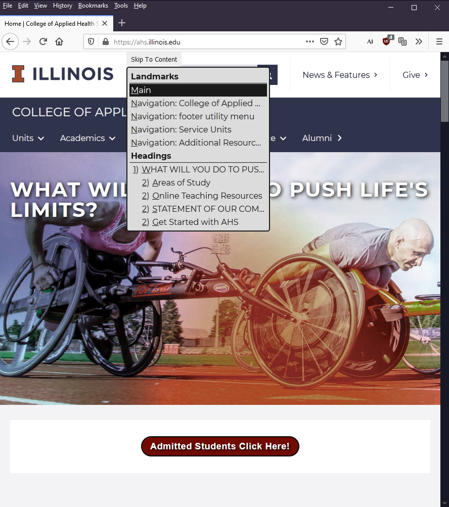

# skipto@4.1

## by PayPal Accessibility Team & University of Illinois

See the [Authors](#authors) section for more information.

SkipTo is a replacement for your old classic "Skip To Main Content" link, (so please use it as such)!
The SkipTo script creates a drop-down menu consisting of the links to important landmarks and headings on a given web page identified by the author. Once installed and configured, the menu makes it easier for keyboard and screen reader users to quickly jump to the desired region of a page by simply choosing it from the list of options.

### Benefits

* Modern way to conform to the "[Bypass Blocks](https://www.w3.org/TR/WCAG/#bypass-blocks)" requirement of the [Web Content Accessibility Guidelines](https://www.w3.org/TR/WCAG/).
* Screen reader users can get a higher level navigation menu without having to use the screen reader landmark and header navigation commands which typically include longer lists of lower level headings and less used landmarks.
* Keyboard only users can more efficiently navigate to content on a page.
* Speech recognition users can use the menu to more efficiently navigate to content on a page.
* When the "Skip To Content" menu button is visible when the page is loaded everyone can use it to identify and navigate to important regions on a page.
* Authors can configure SkipTo to identify the most important regions, ideally about 7-12 items to make it easier for people to read the list and choose an option.  Remember the more items, the longer it will take for the user to identify which item they want to choose.



## Websites using SkipTo

There are two main ways to use the menu button for SkipTo in a page.  In the default configuration the menu button is always visible making it useful to everyone to easily find and navigate to the important content regions identified by the author.  This is similar to how curb cuts help more than just people using wheelchairs.  It is also easier for people using voice recognition to activate the button using the "click skip to content" command and use similar voice commands to activate SkipTo menu items.  The "popup" option is the more traditional approach to fulfilling the "[bypass bocks](https://www.w3.org/TR/WCAG/#bypass-blocks)" requirement of the [Web Content Accessibility Guidelines](https://www.w3.org/TR/WCAG/), but this option makes the feature less visible to people who might benefit.

### Visible Menu Button (default)
* [DRES Accessible IT Group](https://accessibleit.disability.illinois.edu/)
* [College of Applied Health Sciences](https://ahs.illinois.edu/)
* [Illinois Webcon](https://webcon.illinois.edu/)

### Popup Menu Button
* [Admissions at the University of Illinois](https://admissions.illinois.edu/)
* [Nightingale Design Research](https://nightingaledesignresearch.com)
* [cPanel Web Hosting Service @ Illinois](http://cpanel.web.illinois.edu)
* [Functional Accessibility Evaluator (FAE)](https://fae.disability.illinois.edu/)
* [Study Abroad Program for College of Education](https://studyabroad.education.illinois.edu)

NOTE: Popup menu button option is available through configuration of SkipTo when it is loaded.

## How it works

1. The SkipTo menu button should be the first tabable element on the page, and by default the button is visible, but can be configured to "popup" when the button becomes receives focus.
2. Once the keyboard focus is on the menu button, pressing the ENTER, SPACE, DOWN ARROW or UP ARROW keys will pull down the list of important landmarks and headings on the page.  The button is based on the ARIA Authoring Practice [design pattern for menu button](https://w3c.github.io/aria-practices/#menubutton).
3. Use arrow keys to select your choice and press ENTER to move focus to the section of the page.
4. If you decide to reach the menu again, simply press the built-in access key (0 by default). See the notes on [Access keys](#access-keys) for More information on how to use them.

## Access keys

Access keys work  just like regular shortcut keys except that they need a browser-specific modifier key in order to work. For example, to use the "SkipTo" access key, you would press the modifier key + the access key ("0" is the default accesskey). A list for how this would work in most popular browsers and operating systems.

* Mozilla Firefox -- Alt+Shift+0 (Windows or Linux) and Control+Option+0 (Mac OS)
* Google Chrome and Opera -- Alt+0 (Windows or Linux) and Control+Option+0 (Mac OS).
* Safari -- Control+Option+0 (MacOS).

NOTE: Browsers on iOS and iPadOS devices support `accesskey` to move focus to the menu button, but do not support the menu button keyboard commands to use the menu at this time.  Browsers on Android devices do not support `accesskey`s at this time.

## Adding to Website

All you need are either skipto.js or skipto.min.js from the "downloads/js" directory. Please note that skipto.min.js is a minified (a lighter version) of the script.
If you would like to be able to debug your production-ready script, include the provided skipto.min.js.map file as well.

### Local File on Your Web Server

Copy the `skipto.js` or `skipto.min.js` to the file system of your web server and reference it from your web page or templates using a `script` tag, as follows:

```html
<script src="https://[path to Javascript files]/skipto.min.js"></script>
```

### CDN Service

The easiest way is to include a reference to `skipto.min.js`  on your HTML page or template is through the CDN service, as follows:

```html
<script src="https://paypal.github.io/skipto/downloads/js/skipto.min.js"></script>
```

NOTE: CDN referenced files may not be available to computers behind firewall protected networks.

### What About Joomla?

Joomla 4.0 includes **skipto** as a default plugin

## Configure Options

All settings have a default value, a configuration object can be used to change the default values.

### Options for adding the `button` element

The following options are useful for identify where the menu will be in the DOM structure of the page and which elements will be used as the container for the menu button.  The options are of type `string`.

| Property       | default     | Description |
| :------------- | :---------- | :---------- |
| `displayOption` | 'static' | Values of `static`, `fixed` or `popup` are defined.  The value `static` the button is always visible, the value `fixed` the button is always visible at the top of the page even when the page scrolls, and the value `popup` is used the button is initially not visible, but becomes visible when it receives focus. |
| `accessKey` | '0' | [Accesskey](https://developer.mozilla.org/en-US/docs/Web/HTML/Global_attributes/accesskey) provides a way to open the Skip To menu from anywhere on the page, the default is the number zero. |
| `attachElement` | 'header' | A CSS selector for identifying which element to attach the menu button container.  If the `header` element is not present, it will use the `body` element as the default.|
| `containerElement` | 'div' | Element to use as a container for the button and the menu.
| `customClass` | none | CSS class added to the container element. Can be used for customize styling of the button and menu with author supplied stylesheet. |
| `containerRole` | none | Optional landmark role added to a container element, if the container element is not within a landmark.  Ideally the menu button is placed within the `banner` landmark (e.g. `header` element. |

### Button Positioning

| Property       | Type   | Default | Description |
| :------------- | :----- | :------ | :---------- |
| `positionLeft` | length | `46%`  | The position of the "Skip To Content" button from left margin. |

### Button Font Family and Font Size

| Property       | Type   | Default | Description |
| :------------- | :----- | :------ | :---------- |
| `fontSize` | CSS font size | `inherit`  | Set the CSS `font-size` using the configuration object. |
| `fontFamily` | CSS font string | `inherit`  | Set the CSS `font-family` using the configuration object. |

### CSS Selectors for identifying Landmarks and Headings

The `landmarks` and 'headings' options are CSS selectors used to identify the important landmarks and headings on the page for the purpose of keyboard navigation.  The list of landmarks and headings should be **relatively short**, the more items the menu contains the more time the user will need to scan and navigate to the section they want to "skip to".

The options are of type `string`.

| Property       | Default | Description |
| :------------- | :------ | :---------- |
| `landmarks` | 'main, [role="main"], [role="search"], nav, [role="navigation"], aside, [role="complementary"]' | A set of CSS selectors used by `querySelectorAll` to get an array of landmark elements. |
| `headings` | 'main h1, [role="main"] h1, main h2, [role="main"] h2' | A set of CSS selectors used by `querySelectorAll` to get an array of heading elements. |

### Color Theme Options

A color theme sets all the color options defined by the theme.  There is only one theme at this time.

| Property       | Type   | Default | Description |
| :------------- | :----- | :------ | :---------- |
| `colorTheme` | string | `default`  | A predefined color scheme for skipTo, currently values 'default', 'illinois' and 'aria'|

### Colors used for Button and Menu styling

Color values must use [CSS color values](https://developer.mozilla.org/en-US/docs/Web/CSS/color_value), for example `#8AF`, `rgb(40, 50, 90)`, `#a0bf32`, `blue`.

| Property       | Type   | Default | Description |
| :------------- | :----- | :------ | :---------- |
| `buttonTextColor` | Color | `#1a1a1a`  | Color of text for "Skip To Content" button. |
| `buttonBackgroundColor` | Color | `#eeeeee` | Background color of text for "Skip To Content" button. |
| `focusBorderColor` | Color | `#1a1a1a` | Border color for items with keyboard focus. |
| `menuTextColor` | Color | `#1a1a1a` | Menu text color |
| `menuBackgroundColor` | Color | `#dcdcdc` | Menu background color. |
| `menuitemFocusTextColor` | Color | `#eeeeee`  | Menuitem text color when a menuitem has focus. |
| `menuitemFocusBackgroundColor` | Color | `#1a1a1a`  | Menuitem text background when a menuitem has focus. |

NOTE: Make sure colors meet the color contrast requirements of WCAG 2.1 for text

### Heading Shortcuts and Action Menu Options

The inclusion of heading level shortcut keys and the more landmarks and more headings action buttons are enabled by default, but they can be disabled through configuration.  The values are of type boolean.

| Property       | Default | Description |
| :------------- | :------ |:---------- |
| `enableActions` | 'false' | Enable ('true') or disable ('false') the action buttons in the menu.  This should only be enabled if you feel the full heading and landmark strcuture of your pages would be useful for keyboard navigation.  NOTE: Enabling this feature can result in long lists of headings or landmarks that may not be very useful to users.  |
| `enableHeadingLevelShortcuts` | 'true' | Enable ('true') or disable ('false') the heading levels on the heading menu items. |

## Internationalization (I18N)

The text labels and messages can be updated through configuration to local language requirements.

### Button Labeling

The labels and messages can be localized for specific languages or updated to reflect custom selectors.

| Property       | Default | Description |
| :------------- | :------ |:---------- |
| `buttonLabel` | 'Skip to Content' | Change the label for the button. |
| `buttonTooltip` | _empty string_ | Help message when accesskey is not defined. |
| `buttonTooltipAccesskey` | 'Accesskey is "$key"' | Help message when an accesskey is defined. |
| `accesskeyNotSupported` | _empty string_ | No longer used in tooltip. |

#### Deprecated Button Labeling

The following properties were deprecated for a more descriptive title of "tooltip", which now has keyboard suport.

| Property       | Default | Description |
| :------------- | :------ |:---------- |
| `buttonTitle` | _empty string_ | Deprecated help message when accesskey is not defined, use `buttonTooltip` instead. |
| `buttonTitleAccesskey` | _empty string_ | Deprecated help message when an accesskey is defined, use `buttonTooltipAccesskey` instead. |


### Menu, Group and Menuitem Labeling

The labels and messages can be localized for specific languages or updated to reflect custom selectors.

| Property       | Default | Description |
| :------------- | :------ |:---------- |
| `menuLabel` | 'Landmarks and Headings' | Change the label for the menu. |
| `landmarkGroupLabel` | 'Landmarks' | Menu group label for landmarks . |
| `headingGroupLabel` | 'Headings' | Menu group label for headings. |
| `mofnGroupLabel` | '$m of $n' | Provides information on the number of items that are displayed and the total number of items in the document.  The information is added to the landmark and heading group labels. |
| `headingLevelLabel` | 'Heading level' | Used for `aria-label` to improve labeling of heading menu items for screen reader users. |
| `mainLabel` | 'main' | The label in the menu for `main` landmarks |
| `searchLabel` | 'search' | The label in the menu for `search` landmarks |
| `navLabel` | 'navigation' | The label in the menu for `navigation` landmarks |
| `asideLabel` | 'aside' | The label in the menu for `complementary` landmarks |
| `footerLabel` | 'footer' | The label in the menu for `contentinfo` landmarks |
| `headerLabel` | 'header' | The label in the menu for `banner` landmarks |
| `formLabel` | 'form' | The label in the menu for `form` landmarks |
| `msgNoLandmarksFound` | 'No landmarks to skip to'| Message for when no landmarks are found. |
| `msgNoHeadingsFound` | 'No main headings to skip to'| Message for when no headings are found. |

### Action labeling

The labels and messages can be localized for specific languages or updated to reflect custom selectors.

| Property       | Default | Description |
| :------------- | :------ |:---------- |
| `menuLabel` | 'Landmarks and Headings' | Change the label for the menu. |
| `landmarkImportantGroupLabel` | 'Important Landmarks' | Menu group label for
| `actionGroupLabel` | 'Actions' | The group label for the action menu items. |
| `actionShowHeadingsHelp` | 'Toggles between showing "All" and "Important" headings.' | The value of the title attribute for the show headings action menu item. |
| `actionShowImportantHeadingsLabel` | 'Show Important Headings ($num)' | The label for the menu item when the button action is to show "Important" headings. |
| `actionShowAllHeadingsLabel` | 'Show All headings ($num)'| The label for the menu item when the button action is to show "All" headings. |
| `actionShowLandmarksHelp` | 'Toggles between showing "All" and "Important" landmarks.' | The value of the title attribute for the show landmarks action menu item. |
| `actionShowImportantLandmarksLabel` | 'Show Important landmarks ($num)' | The label for the menu item when the button action is to show "Important" landmarks. |
| `actionShowAllLandmarksLabel` | 'Show All landmarks ($num)'  | The label for the menu item when the button action is to show "All" landmarks. |
| `actionShowImportantHeadingsAriaLabel` | 'Show $num Important Headings' | The `aria-label` for the menu item when the button action is to show "Important" headings. |
| `actionShowAllHeadingsAriaLabel` | 'Show All $num headings'| The `aria-label` for the menu item when the button action is to show "All" headings. |
| `actionShowImportantLandmarksAriaLabel` | 'Show $num Important landmarks' | The `aria-label` for the menu item when the button action is to show "Important" landmarks. |
| `actionShowAllLandmarksAriaLabel` | 'Show All $num landmarks'  | The `aria-label` for the menu item when the button action is to show "All" landmarks. |

## Example Settings

If have different requirements for your web site and include other heading levels as well as ARIA landmarks, you will need to provide a JSON object containing the necessary configuration parameters. The following is a sample configuration:

```html
<script>
var SkipToConfig =  {
  'settings': {
    'skipTo': {
      landmarks: 'main, [role="main"], [role="search"], nav',
      headings: 'main h1, main h2, main h3',
      colorTheme: 'illinois'
    }
  }
};
</script>
```

### HTML, Classes and Ids for custom styling

The source code in this section is for developers to understand the HTML, classes and ids used in the SkipTo menu button and menu for use in custom styling.

```html
<div
  class="skip-to"
  title='Keyboard Navigation Accesskey is "Alt+0"'
>
  <!--
  //
  // Menu Button
  //
  -->
  <button
    aria-haspopup="true"
    aria-expanded="true"
    accesskey="0">
    Skip To Content
  </button>
  <!--
  //
  // ARIA enabled menu
  //
  -->
  <div role="menu">
    <!--
    //
    // Landmark group label and menu items
    //
    -->
    <div id="id-skip-to-group-landmarks-label"
      role="separator">
      Important Landmarks
    </div>
    <div role="group"
      aria-labelledby="id-skip-to-group-landmarks-label" id="id-skip-to-group-landmarks">
      <div role="menuitem"
        class="landmark skip-to-main skipto-nesting-level-0"
        data-id="1">
        <span class="label">Main</span>
      </div>
      <div role="menuitem"
        class="landmark skip-to-nav skipto-nesting-level-0"
        data-id="2">
        <span class="label">Navigation: SkipTo test pages</span>
      </div>
      <!--
      ... more menu items ...
      -->
    </div>
    <!-- End Landmarks Group -->

    <!--
    //
    // Heading group label and menu items
    //
    -->
    <div id="id-skip-to-group-headings-label"
      role="separator">
      Important Headings
    </div>
    <div role="group"
      aria-labelledby="id-skip-to-group-headings-label"
      id="id-skip-to-group-headings">
      <div role="menuitem"
        class="heading skip-to-h1"
        data-id="9"
        data-level="1">
        <span class="level"><span>1</span>)</span>
        <span class="label">Example Content</span>
      </div>
      <div role="menuitem"
        class="heading skip-to-h2"
        data-id="10"
        data-level="2">
        <span class="level"><span>2</span>)</span>
        <span class="label">Pastrami</span>
      </div>
      <!--
      ... more menu items ...
      -->
    </div>
    <!-- End Headings Group -->
  </div>
</div>


```

### Notes

* Parameters are optional.
* SkipTo will be attached to the `header`element as the first child by default.  If the `header`element is not present, it will be attached as the first child of the `body` element on the page.  The attachment can be changed using the "attachElement" parameter.
* When the custom class is specified (see the customClass parameter), the user can override the style:

```css
.skip-to.MyCustomClass {
  background:  red;
  left: 50px;
  top: 50px;
}
```

## Compiling CSS and JavaScript

You may feel slightly adventurous and decide to change some colors or even enhance the script with your changes. Once you do this, here is how you compile the skipTo script for production.

```sh
git clone https://github.com/paypal/skipto.git
cd skipto
sudo npm install grunt-cli -g
npm install
grunt
```

1. You should now have a directory called **`downloads`** with the necessary files in it.
1. See instructions above on which files you need to get the SkipTo script running on your web site.

Note: On Windows, build-win.bat runs npm install and grunt modules (Step 3). To successfully run, you must launch a Windows command prompt as an Admin (Ctrl+Shift+Enter) and then run build-win.bat from this command prompt.

## Cleaning up

If you would like to revert your local code repository to its initial state, simply run

```sh
grunt clean
```

from the root directory of your repository.

## Of course, we want feedback

Please do not hesitate to [raise issues and comment on Github](https://github.com/paypal/skipto/issues) if something doesn't work or you have ideas on how to improve the script.

Happy skipping!

## Authors

### Current Contributors

**Jon Gunderson**
[https://github.com/jongund](https://github.com/jongund)

**Nicholas Hoyt**
[https://github.com/nhoyt](https://github.com/nhoyt)

**Prem Nawaz Khan**
[https://github.com/mpnkhan](https://github.com/mpnkhan) || [@mpnkhan](https://twitter.com/mpnkhan)

**Brian Teeman**
[https://github.com/brianteeman](https://github.com/brianteeman)

### Previous Contributors

**Victor Tsaran**
[https://github.com/vick08](https://github.com/vick08) || [@vick08](https://twitter.com/vick08)

**Ron Feathers**
[https://github.com/rfeathers](https://github.com/rfeathers) || [@ronfeathers](https://twitter.com/ronfeathers)

**Marc Kocher**
[https://github.com/mdkocher](https://github.com/mdkocher) || [@marckocher](https://twitter.com/marckocher)


## Version History

### Version 4.1.6
* Revert the changes from 4.1.4

### Version 4.1.5
* Corrects packaging error in 4.1.4

### Version 4.1.4
* Fixes problem in failure to create the SkipTo menu due to invalid configuration

### Version 4.1.3
* Region landmarks must have an accessible name to be included as a landmark in the SkipTo menu to comply with ARIA specification for landmark regions, and will region landmarks be included after complementary landmarks in the SkipTo menu.
* Updated landmark prefixes in menu to align with actual ARIA role names with the following changes:
  * `header:` => `banner`
  * `footer:` => `contentinfo`
  * `aside:` => `complementary`

### Version 4.1.2
* Added <code>aria-busy="true"</code> attribute to menu element when SkipTo is initialized and being updated with new menu items to support validators looking for required menu items for the <code>menu</code> role.
* Added the <em>optional</em> <code>aria-controls</code> attribute to button element to reference the <code>id</code> of the menu element as defined in the W3C ARIA Authoring practices for [menu button pattern](https://w3c.github.io/aria-practices/#menubutton).

### Version 4.1.1
* Removed <code>aria-describedby</code> from button, since screen readers read the <code>accesskey</code> information.

### Version 4.1
* Added feature for the <kbd>escape</kbd> key to hide tooltip when focus is on button.
* Added new properties to set font family and font size.
* Adding CSS properties to the <code>.label</code> and <code>.level</code> class so the inherited values from <code>[role="menuitem"]</code> are not overridden as easily by other stylesheets used on a page.
* Updated moving focus to improve moving focus to visible targets within landmarks.
* Fixed broken shortcut keys in the menu

### Version 4.0.5
* Fixes a problem introduced in version 4.0.4 when button tooltip was updated, restores support for `buttonTitle` and `buttonTitleWithAccesskey` configuration properties.

### Version 4.0.4
* Popup tooltip shows accesskey to open menu when button on hover or focus.
* Popup tooltip is only displayed when a known accesskey is supported by the browser and device operating system.
* Popup tooltip supports high contrast operating system settings.
* Action menu items are disabled by default.
* M of N items in landmark or heading list is disabled by default.
* CDN reference to `skipto.min.js` is now available from University of Illinois.
* Changed the way the button is hidden visually in "popup" mode not to create wider pages

### Version 4.0.3
* Fixed bug in using role description as a class name for menuitem
* Fixed bug in setting `menuTextColor` property.
* Updated documentation.

### Version 4.0.2
* Changed landmarks from using the tag name in the class list to custom skip-to prefixed tag name.
* Fixed bug when no landmarks or headings found.
* Simplified color configuration options.

### Version 3.1.4
* Fixed Joomla configuration option.
* Added _m_ of _n_ to landmark and heading group labels.

### Version 3.1.3
* Added "fixed" to the `displayOptions` customization.

### Version 3.1.2
* Fixed bug in moving focus for landmarks.

### Version 3.1.1
* Changed "Important" to "Selected" landmarks and headings.

### Version 3.1

* Added `aria-label` for action menu items to make the label screen reader friendly
* For heading menuitems, use `aria-label` to make the label more like a screen reader
* Use element names as landmark labels instead of landmark names
* Support `aria-roledescription` for labeling landmark roles in menu
* Nested landmarks and header levels are indented
* Added actions to toggle between "Important" and "All" landmarks and headings.
* Added additional keyboard shortcuts in the menu based on heading level.
* Added more information about accesskey in help.
* Fixed bugs in 3.0

### Version 3.0

* Removed id selector options, if ids are needed they could be added to the landmarks selector
* Removed need to call initialization function
* Removed support for Internet Explorer
* Improved code readability and ARIA support, by removing complexity needed to support Internet Explorer
* Improved configuration of button and menu labeling
* Add configuration of button and menu colors, without adding a stylesheet
* Update the landmarks and headings in the menu by querying the DOM every time the menu is opened
* Reduced markup conflicts by using a data attribute rather than an IDREF for targets
* Reduced changes in page markup by only applying tabindex=-1 when focus is moved to a target
* Updated the function for testing if an element is visible

### Version 2.1

* Ignore hidden landmarks and headings, based on:
  * CSS: display: none
  * CSS: visibility: hidden
  * HTML5 hidden attribute
  * ARIA 1.0 aria-hidden=true attribute
  * ARIA 1.0 role=presentation attribute
  * any element that is less than 4 pixels high or wide

### Version 2.0

* Support for HTML5 section elements
* Calculate accessible names for landmarks and headings
* Updated menu to separate headings from landmarks
* Created default for main content
  * main element
  * [role=Main]
* Created default for HTML5 sections
  * nav element
* Updated defaults for landmarks
  * [role=navigation]
  * [role=search]
* Updated defaults for headings
  * h1 element
  * h2 element

## Copyright and license

Copyright 2021, PayPal and University of Illinois under the [BSD license](LICENSE.md).
